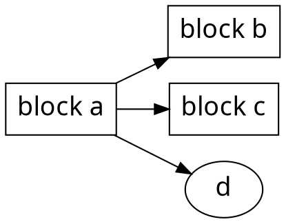

# MCK Strategy Training


The 

Examples
---
- [this is a test]()
- [Book example](/s/book-example)
- [Slide example](/s/slide-example)
- [YAML metadata](/s/yaml-metadata)
- [Features](/s/features)

Themes
---
- [Dark theme](/theme-dark?both)
- [Vertical alignment](/theme-vertical-writing?both)

###### tags: `Templates` `Book`
